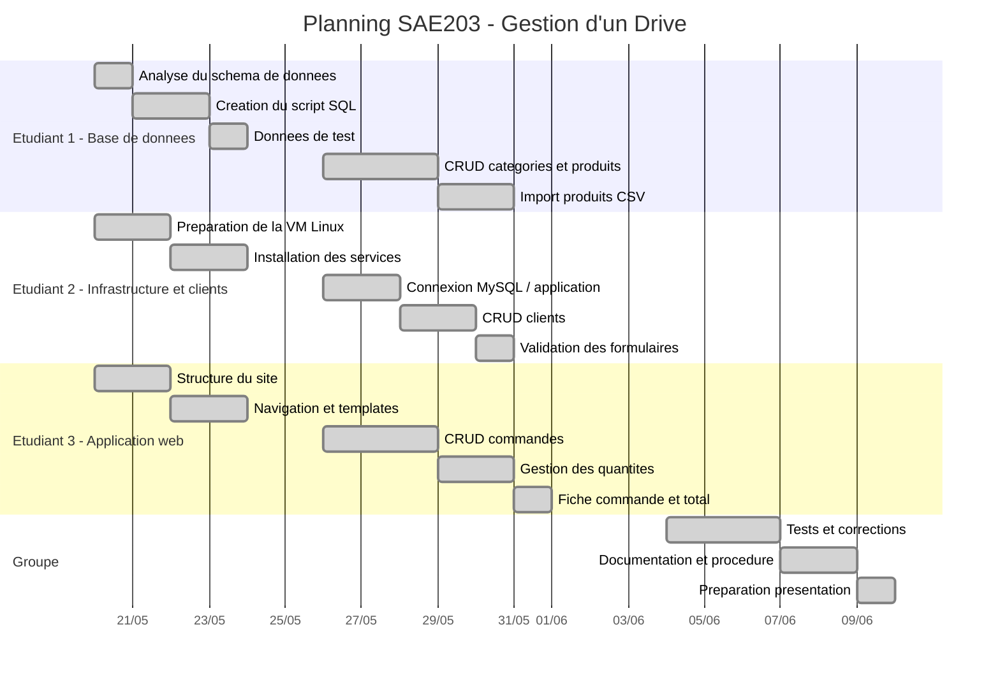

# Planning du projet SAE203

Ce planning resume la repartition des taches du projet de gestion d'un Drive.

## Tableau de repartition

| Etudiant | Responsabilites |
| --- | --- |
| Etudiant 1 | Base SQL, schema relationnel, tables, donnees de test, CRUD categories, CRUD produits, import CSV |
| Etudiant 2 | VM Linux, installation des services, configuration MySQL, CRUD clients, validation des formulaires |
| Etudiant 3 | Structure web, navigation, CRUD commandes, lignes de commande, calcul du total |
